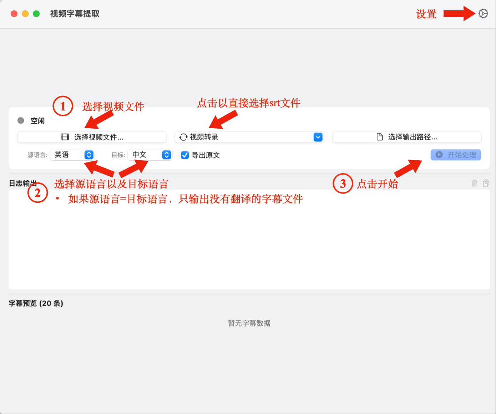
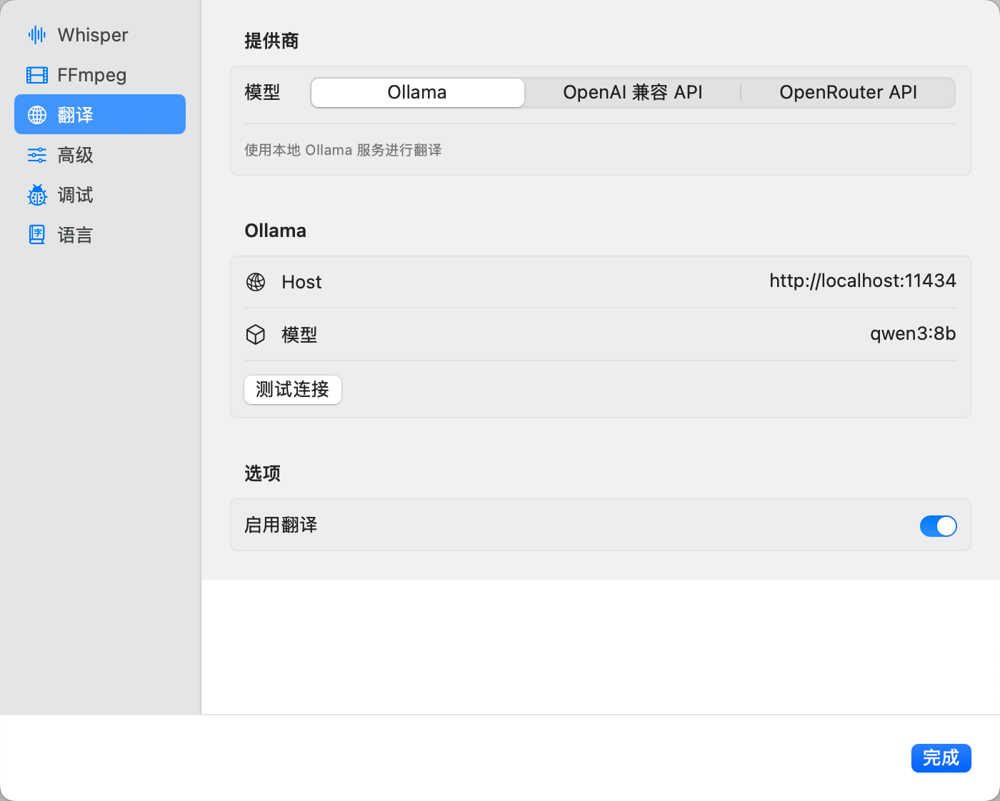
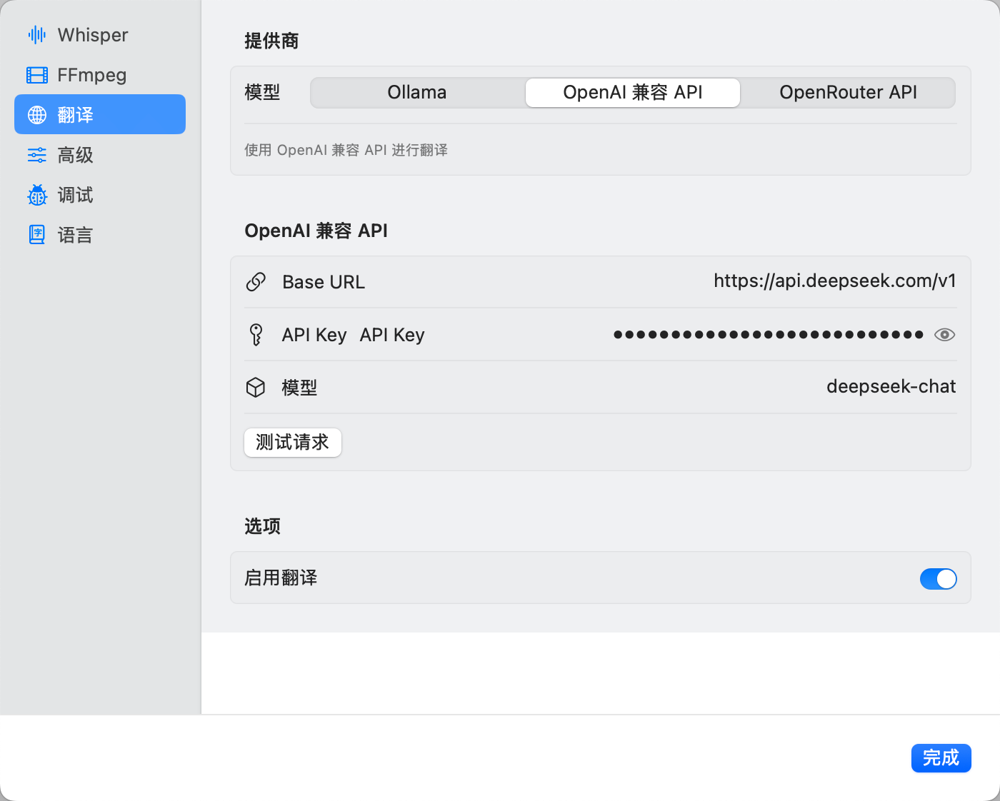
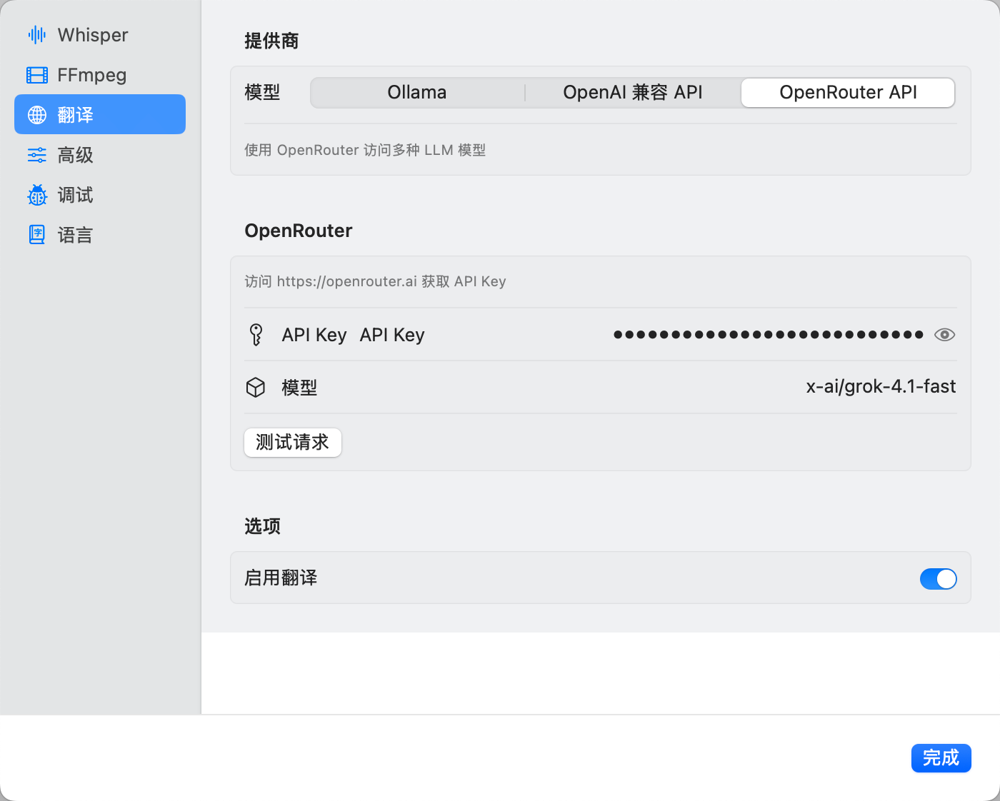

<p align="center">
  
</p>

<div align="center">

[中文](README.md) | [English](README_EN.md)

</div>

<!-- <p align="center">
  <a href="https://github.com/zyxial/TransSub/releases"></a>
  <a href="https://github.com/zyxial/TransSub/blob/main/LICENSE"></a>
</p> -->

> [!IMPORTANT]
> 本仓库仅用于软件分发和反馈收集，源代码未开源。

# TransSub

免费macOS平台视频字幕提取与翻译工具。


## ✨ 核心优势

| 优势 | 说明 |
| :--- | :--- |
| **🔒 隐私安全** | 完全本地运行，视频不上传云端 |
| **🚀 开箱即用** | 内置 whisper.cpp（Metal GPU 加速），只需安装 ffmpeg |
| **⚡ Apple Silicon 加速** | Metal GPU 加速，转写速度提升数倍 |
| **🎯 高精度识别** | 支持 Whisper 模型 |
| **🌐 自定义翻译API** | 支持Ollama 本地翻译 / OpenAI格式兼容API 两种模式 |
| **💾 资源友好** | 流式处理，大文件不占内存 |
| **🌍 多语言支持** | 流目前支持中文和英文 |

## 功能特性

### 视频处理
- 支持 MP4、MKV、MOV、AVI 等常见格式
- 自动提取 16kHz 单声道 WAV 音频
- 智能分块处理，长视频无压力

### 语音识别
- **内置 whisper.cpp**（Metal GPU 加速版）
- 支持 Bin/GGUF 模型格式
- 自动语种检测
- 支持VAD(Voice Activity Detection) 语言活动检测（可选）

### 智能翻译
- **Ollama 本地翻译** - 完全离线，隐私无忧
- **OpenAI API 翻译** - 高质量翻译，联网使用

### 字幕导出
- 标准 SRT 格式
- 精确时间轴
- 原文/译文双输出
- 兼容所有主流播放器（如IINA）

## 快速上手

### 1. 安装依赖

```bash
# 安装 ffmpeg（唯一需要安装的依赖）
brew install ffmpeg

# 安装 Ollama（可选，用于本地翻译）
brew install ollama
```

### 2. 下载应用

从 [Releases](https://github.com/ethanzylin/TransSub/releases) 下载最新版本

### 3. 下载 Whisper 模型

从 Hugging Face 下载 Whisper Bin/GGUF 模型：

**[ggerganov/whisper.cpp](https://huggingface.co/ggerganov/whisper.cpp/tree/main)**

推荐模型：
- `ggml-medium.bin` - **推荐首选**，精度与速度平衡
- `ggml-large-v3-turbo.bin` - 接近 large-v3 精度，速度更快
- `ggml-large-v3.bin` - 高精度

### 4. 配置使用

1. 在应用中配置 Whisper 模型路径
2. 配置翻译服务 (二选一)：
   - **Ollama**: 启动 `ollama serve`，下载模型 `ollama pull qwen3:8b`
   - **OpenAI API**: 配置 API Key
3. 导入视频，一键生成字幕：

4. (可选) 配置VAD模型，推荐Hugging Face下载地址：**[ggml-org/whisper-vad](https://huggingface.co/ggml-org/whisper-vad/tree/main)**。
（当视频中有很多无人声场景，或识别不够准确时，可尝试配置）


> **注意**：ffmpeg 需要通过 Homebrew 安装，whisper.cpp 已内置 Metal 加速版本。

## （可选）Ollama 本地翻译模型配置

```bash
# 1. 启动 Ollama 服务
ollama serve

# 2. 下载翻译模型（推荐 qwen3:8b，中英文翻译效果优秀）
ollama pull qwen3:8b
```

推荐模型：
- `qwen3:8b` - 平衡速度与质量，中英文翻译效果优秀
- `qwen3:4b` - 内存占用更小，速度更快

Ollama设置示例：


## OpenAI 兼容/OpenRouter API Key配置
OpenAI兼容API设置示例：


OpenRouter API设置示例：


## 系统要求

- macOS 14.0+ (Sonoma 或更新版本)
- Apple Silicon (M1/M2/M3/M4)
- [Homebrew](https://brew.sh)（用于安装依赖）

## 常见问题

**Q: 需要安装 whisper.cpp 吗？**
A: 不需要，应用已内置带 Metal GPU 加速的版本。

**Q: ffmpeg 需要安装吗？**
A: 是的，需要通过 `brew install ffmpeg` 安装。

**Q: Whisper 模型从哪里下载？**
A: 从 [ggerganov/whisper.cpp](https://huggingface.co/ggerganov/whisper.cpp/tree/main) 下载 Bin/GGUF 格式模型。

**Q: Ollama 翻译模型如何选择？**
A: 推荐 `qwen3:8b`，中英文翻译效果优秀且资源占用合理。

**Q: 转写速度如何？**
A: Macbook Pro m4 Pro 实测处理一个14分钟，244句对话的视频，启用VAD，调用本地ollama（qwen3:8B），用时为4分钟，调用deepseek api （一次处理20条对话），用时3分钟，其中翻译前的语言处理阶段耗时约为1分钟。

**Q: 支持哪些翻译服务？**
A: Ollama 本地翻译和 OpenAI兼容/OpenRouter API。

**Q: 字幕格式兼容吗？**
A: 标准 SRT 格式，VLC、IINA、MPV 等播放器均可使用。

**Q: 打开 App 时提示"无法验证开发者"怎么办？**
A: 这是 macOS 的安全机制，因为 App 未通过 Apple 审核。解决方法：
1. 打开"系统设置" > "隐私与安全性"
2. 在"安全性"区域找到"仍要打开"按钮
3. 点击"仍要打开"确认运行

## 反馈

如有建议或问题，请通过 [GitHub Issues](https://github.com/ethanzylin/TransSub/issues) 反馈，或<a href="&#109;&#97;&#105;&#108;&#116;&#111;&#58;&#116;&#114;&#97;&#110;&#115;&#115;&#117;&#98;&#64;&#111;&#104;&#109;&#121;&#100;&#111;&#99;&#46;&#100;&#101;">邮件联系我</a>。

## 许可证

闭源软件，仅供个人使用。

## 支持作者☕

<a href="https://buymeacoffee.com/zyzzz">
  
</a>
