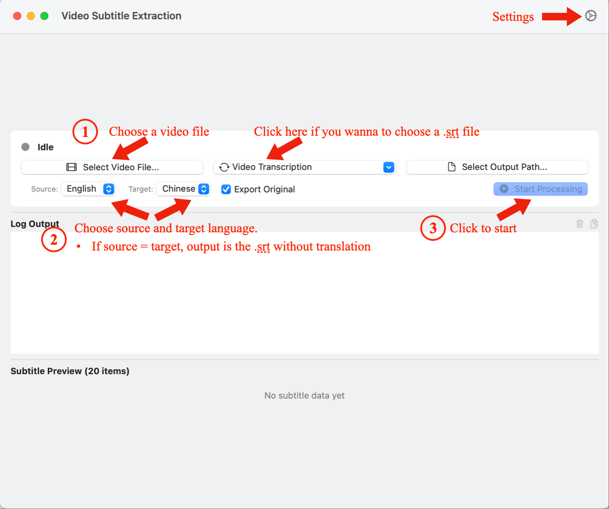
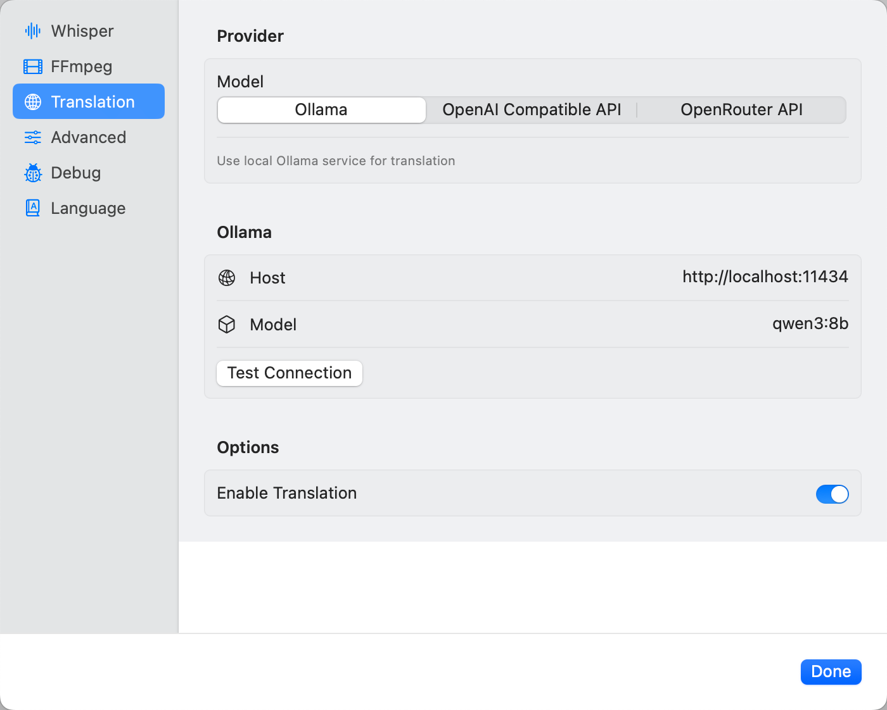
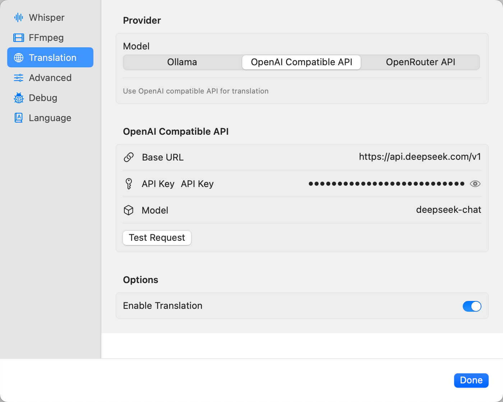
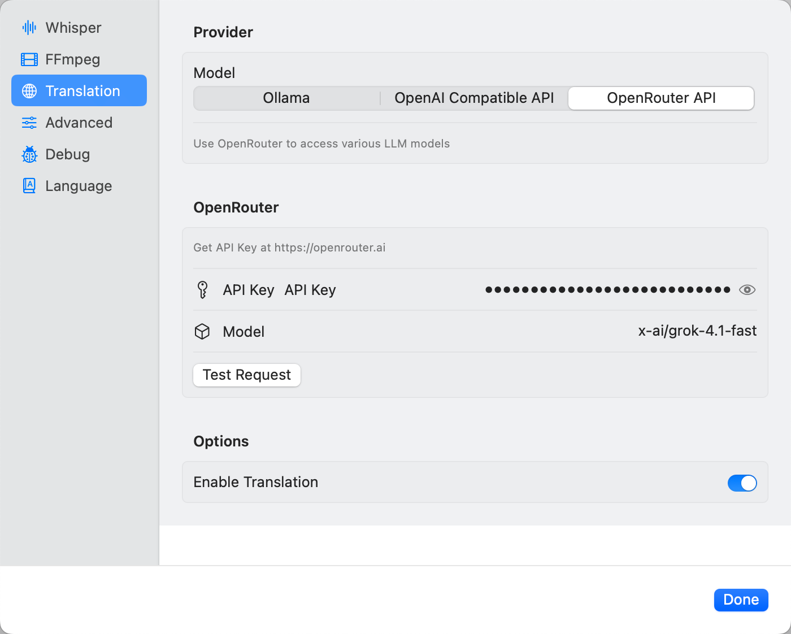

<p align="center">
  
</p>

<div align="center">

[中文](README.md) | [English](README_EN.md)

</div>

> [!IMPORTANT]
> This repository is only for software distribution and feedback collection. The code is not open source.

# TransSub

A free macOS video subtitle extraction and translation tool.


## ✨ Key Features

| Feature | Description |
| :--- | :--- |
| **🔒 Privacy & Security** | Fully local operation, videos are not uploaded to the cloud |
| **🚀 Ready to Use** | Built-in whisper.cpp (Metal GPU acceleration), only ffmpeg required |
| **⚡ Apple Silicon Acceleration** | Metal GPU acceleration, transcription speed several times faster |
| **🎯 High Accuracy** | Supports Whisper models |
| **🌐 Custom Translation API** | Supports Ollama local translation / OpenAI-compatible API |
| **💾 Resource Friendly** | Streaming processing, no memory issues with large files |
| **🌍 Multi-language Support** | Currently supports Chinese and English |

## Features

### Video Processing
- Supports MP4, MKV, MOV, AVI and other common formats
- Automatically extracts 16kHz mono WAV audio
- Smart chunk processing, handles long videos with ease

### Speech Recognition
- **Built-in whisper.cpp** (Metal GPU accelerated version)
- Supports Bin/GGUF model formats
- Automatic language detection
- Supports VAD (Voice Activity Detection) - optional

### Smart Translation
- **Ollama Local Translation** - Fully offline, privacy guaranteed
- **OpenAI API Translation** - High quality translation, requires internet

### Subtitle Export
- Standard SRT format
- Precise timestamps
- Original/translated dual output
- Compatible with all major players (e.g., IINA)

## Quick Start

### 1. Install Dependencies

```bash
# Install ffmpeg (the only required dependency)
brew install ffmpeg

# Install Ollama (optional, for local translation)
brew install ollama
```

### 2. Download the App

Download the latest version from [Releases](https://github.com/ethanzylin/TransSub/releases)

### 3. Download Whisper Model

Download Whisper Bin/GGUF models from Hugging Face:

**[ggerganov/whisper.cpp](https://huggingface.co/ggerganov/whisper.cpp/tree/main)**

Recommended models:
- `ggml-medium.bin` - **Recommended**, balanced accuracy and speed
- `ggml-large-v3-turbo.bin` - Close to large-v3 accuracy, faster speed
- `ggml-large-v3.bin` - High accuracy

### 4. Configure and Use

1. Configure Whisper model path in the app
2. Configure translation service:
   - **Ollama**: Start `ollama serve`, download model `ollama pull qwen3:8b`
   - **OpenAI API**: Configure API Key
3. Import video, generate subtitles with one click:

4. (Optional) Configure VAD model, recommended Hugging Face download: **[ggml-org/whisper-vad](https://huggingface.co/ggml-org/whisper-vad/tree/main)**.
(Configure when there are many scenes without human voice in the video, or the recognition is not accurate enough.)


> **Note**: ffmpeg needs to be installed via Homebrew, whisper.cpp comes with Metal acceleration built-in.

## (Optional) Ollama Local Translation Model Configuration

```bash
# 1. Start Ollama service
ollama serve

# 2. Download translation model (recommended: qwen3:8b, excellent Chinese/English translation)
ollama pull qwen3:8b
```

Recommended models:
- `qwen3:8b` - Balanced speed and quality, excellent Chinese/English translation
- `qwen3:4b` - Lower memory usage, faster speed

Ollama settings example:


## OpenAI Compatible / OpenRouter API Key Configuration
OpenAI compatible API settings example:


OpenRouter API settings example:


## System Requirements

- macOS 14.0+ (Sonoma or newer)
- Apple Silicon (M1/M2/M3/M4)
- [Homebrew](https://brew.sh) (for installing dependencies)

## FAQ

**Q: Do I need to install whisper.cpp?**
A: No, the app comes with a Metal GPU accelerated version built-in.

**Q: Do I need to install ffmpeg?**
A: Yes, install via `brew install ffmpeg`.

**Q: Where to download Whisper models?**
A: Download Bin/GGUF format models from [ggerganov/whisper.cpp](https://huggingface.co/ggerganov/whisper.cpp/tree/main).

**Q: How to choose Ollama translation model?**
A: Recommended `qwen3:8b`, excellent Chinese/English translation with reasonable resource usage.

**Q: How fast is the transcription?**
A: Tested on Macbook Pro M4 Pro, processing a 14-minute video with 244 dialogues, with VAD enabled, calling local Ollama (qwen3:8B) took 4 minutes, calling DeepSeek API (processing 20 dialogues at a time) took 3 minutes, with the speech processing stage taking about 1 minute.

**Q: What translation services are supported?**
A: Ollama local translation and OpenAI compatible/OpenRouter API.

**Q: Is the subtitle format compatible?**
A: Standard SRT format, works with VLC, IINA, MPV and other players.

**Q: What to do when macOS says "Cannot verify developer"?**
A: This is macOS security mechanism. Solution:
1. Open "System Settings" > "Privacy & Security"
2. Find the "Open Anyway" button in the Security section
3. Click "Open Anyway" to confirm

## Feedback

For suggestions or issues, please submit via [GitHub Issues](https://github.com/ethanzylin/TransSub/issues), or <a href="&#109;&#97;&#105;&#108;&#116;&#111;&#58;&#116;&#114;&#97;&#110;&#115;&#115;&#117;&#98;&#64;&#111;&#104;&#109;&#121;&#100;&#111;&#99;&#46;&#100;&#101;">Drop me an email</a>.

## License

Closed source software, for personal use only.

## Support Me ☕

<a href="https://buymeacoffee.com/zyzzz">
  
</a>
